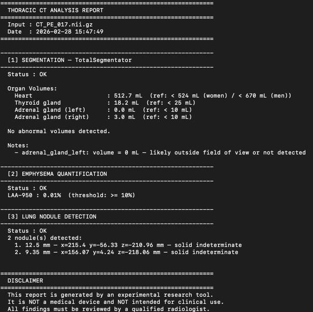
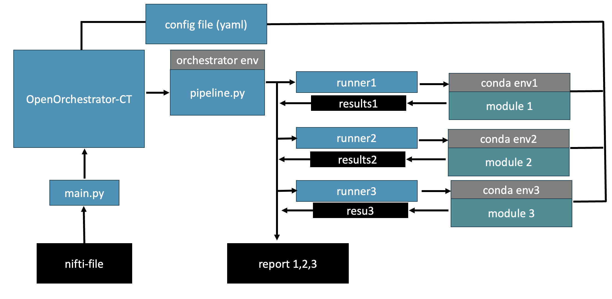

# OpenOrchestratorCT-Pilot

OpenOrchestratorCT-Pilot is a Python orchestration tool that coordinates multiple independent, third-party AI tools to analyze thoracic CT scans (NIfTI format) and produce a unified structured findings report.

The three AI tools used in this project are not included in the code and must be installed separately by the user (see [Installation](#installation)). This project provides a dedicated runner for each tool: a lightweight adapter that handles environment isolation, input/output translation, and subprocess coordination, and an orchestration pipeline that runs them in sequence on a single input scan.

This is a research prototype. It is intended for exploratory, academic and development purposes, and is not validated for clinical use.


---

## What it does

Takes a `.nii.gz` file as input and runs up to three analysis modules (configurable), each in its own isolated conda environment:

1. **TotalSegmentator** — segments anatomical structures and computes volumes for cardiomegaly (heart), goitre (thyroid), and adrenal findings
2. **Emphysema Quantification** — quantifies emphysema via low-attenuation area (LAA) percentage
3. **Lung Nodule Detection** — detects and characterizes pulmonary nodules

Outputs a `.txt` report summarizing all findings.



---

## Project Structure

```
OpenOrchestratorCT-Pilot/
├── run.py                        # Main entrypoint
├── config.yaml                   # Enable/disable modules + paths + conda env names
├── requirements.txt              # Orchestrator dependencies only
├── README.md
│
├── envs/                         # Conda environment files (one per module)
│   ├── totalseg_env.yaml
│   ├── emphysema_env.yaml
│   └── nodules_env.yaml
│
├── orchestrator/
│   ├── __init__.py
│   ├── pipeline.py               # Coordinates runners
│   ├── report.py                 # Assembles final .txt report
│   └── runners/
│       ├── base.py               # Abstract base runner
│       ├── totalsegmentator.py
│       ├── emphysema.py
│       └── nodule.py
│
├── modules/                      # NOT tracked by git — clone the 3 repos here
│   ├── TotalSegmentator/
│   ├── Emphysema_Quantification/
│   └── LungNoduleDetection/
│
├── data-ct-nifti/                # NOT tracked by git — place your .nii.gz files here
│   └── CT_PE_017.nii.gz
│
└── outputs/                      # NOT tracked by git — generated reports land here
```



---

## Requirements

- Python 3.11+
- [Conda](https://docs.conda.io/en/latest/miniconda.html) — required to manage separate CUDA/PyTorch versions per module
- NVIDIA GPU (for HPC/workstation) or Apple Silicon Mac (MPS)

---

## Installation

### Step 1 — Clone this repo

```bash
git clone https://github.com/gfahrni/OpenOrchestratorCT-Pilot.git
cd OpenOrchestratorCT-Pilot
```

### Step 2 — Create the orchestrator conda environment

This is the environment you will always have active when running the orchestrator.
It only contains the lightweight dependencies needed to coordinate the pipeline.

```bash
conda create -n orchestrator python=3.11
conda activate orchestrator
pip install -r requirements.txt
```


### Step 3 — Create a conda environment for each module

Each module requires its own isolated environment to avoid CUDA/PyTorch version conflicts.
The orchestrator calls them internally via `conda run` — you never need to activate them manually.

```bash
conda env create -f envs/totalseg_env.yaml
conda env create -f envs/emphysema_env.yaml
conda env create -f envs/nodules_env.yaml
```

### Step 4 — Clone the necessary analysis modules into `modules/`

```bash
mkdir modules && cd modules
git clone https://github.com/bdrad/Emphysema_Quantification
git clone https://github.com/rlsn/LungNoduleDetection
cd ..
```

> Totalsegmentator need to be installed separately, via pip.
> Follow each module's own README for any additional setup steps (e.g. model weight downloads).

---

## Configuration

Edit `config.yaml` to enable/disable modules and configure device and paths.

Each module have some specific configuration options.

---

## Usage

Run from the project root with the orchestrator environment active.
For example if you ant to process the "CT_PE_017.nii.gz" CT file:

```bash
conda activate orchestrator
python run.py --input data-ct-nifti/CT_PE_017.nii.gz
```

The report will be saved to `outputs/CT_PE_017_report.txt`.

---

## Modules & Licenses

| Module | License | Source |
|--------|---------|--------|
| TotalSegmentator | Apache 2.0 | [GitHub](https://github.com/wasserth/TotalSegmentator) |
| Emphysema Quantification | MIT | [GitHub](https://github.com/bdrad/Emphysema_Quantification) |
| Lung Nodule Detection | MIT | [GitHub](https://github.com/rlsn/LungNoduleDetection) |

This orchestrator is distributed under the MIT License.

---

## Notes

- `modules/`, `data-ct-nifti/`, and `outputs/` are excluded from git via `.gitignore`
- Normative volume thresholds for TotalSegmentator findings are based on:
  Remark et al., Radiology AI 2025 — https://pubs.rsna.org/doi/10.1148/ryai.250506